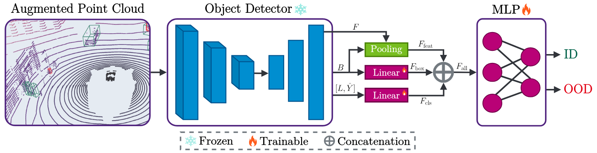

# [IV 2024] Revisiting Out-of-Distribution Detection in LiDAR-based 3D Object Detection


Official Implementation of "Revisiting Out-of-Distribution Detection in LiDAR-based 3D Object Detection" by Michael Kösel, Marcel Schreiber, Michael Ulrich, Claudius Gläser, and Klaus Dietmayer.

[](https://arxiv.org/abs/2404.15879) [](https://ieeexplore.ieee.org/document/10588849)



<!---
## Abstract
LiDAR-based 3D object detection has become an essential part of automated driving due to its ability to localize and classify objects precisely in 3D. However, object detectors face a critical challenge when dealing with unknown foreground objects, particularly those that were not present in their original training data. These out-of-distribution (OOD) objects can lead to misclassifications, posing a significant risk to the safety and reliability of automated vehicles. Currently, LiDAR-based OOD object detection has not been well studied. We address this problem by generating synthetic training data for OOD objects by perturbing known object categories. Our idea is that these synthetic OOD objects produce different responses in the feature map of an object detector compared to in-distribution (ID) objects. We then extract features using a pre-trained and fixed object detector and train a simple multilayer perceptron (MLP) to classify each detection as either ID or OOD. In addition, we propose a new evaluation protocol that allows the use of existing datasets without modifying the point cloud, ensuring a more authentic evaluation of real-world scenarios. The effectiveness of our method is validated through experiments on the newly proposed nuScenes OOD benchmark.
-->

## Installation

### 1. Create virtual env
```shell script
conda create -n mmood3d python=3.8 -y
conda activate mmood3d
```

### 2. Install dependencies
Please make sure to have CUDA 11.1 installed and in your PATH.

```shell script
# install pytorch
pip install torch==1.9.0+cu111 torchvision==0.10.0+cu111 torchaudio==0.9.0 -f https://download.pytorch.org/whl/torch_stable.html

# install openmim, used for installing mm packages
pip install -U openmim

# install mm packages
mim install "mmengine" "mmcv==2.1.0" "mmdet==3.2.0" "mmdet3d==1.4.0"

# workaround issues with tensorboard
pip install setuptools==59.5.0 Pillow==9.5.0
```

### 3. Install mmood3d
Assuming your terminal is in the mmood3d directory:
```shell script
pip install -v -e .
```

## Data Preparation
1. Download nuScenes [https://www.nuscenes.org/download].

2. Copy or softlink the files into the `data/` directory. The structure of the data directory should be as follows:

```shell script
data
├── nuscenes
│  ├── v1.0-trainval (nuScenes files)
│  ├── sweeps (nuScenes files)
│  ├── samples (nuScenes files)
│  ├── nuscenes_gt_database (See step 3)
│  ├── nuscenes_dbinfos_train.pkl (See step 3)
│  ├── nuscenes_infos_train.pkl (See step 3)
└  └── nuscenes_infos_val.pkl (See step 3)

```

3. Generate the annotation files.  This will put the annotation files into the `data/` directory by default. The process can take some while.
Note, that we use a custom version of create_data.py, therefore data generated by the official mmdetection3d code is not compatible.
```shell script
python tools/create_data.py nuscenes --root-path ./data/nuscenes --out-dir ./data/nuscenes --extra-tag nuscenes
```

## Train OOD Detector
We provide weights for the CenterPoint detector trained on nuScenes with frames containing OOD objects removed. Download from [here](https://github.com/uulm-mrm/mmood3d/releases/download/base_detector/base_centerpoint_voxel01_second_secfpn_8xb4_cyclic_20e_nus_3d_known.pth) and place the checkpoint into the `checkpoints/` directory.
We provide the configurations we use in the paper in the `mmood3d/configs` directory. When you want to train, e.g., with the full version:
```shell
# single gpu
python tools/train.py mmood3d/configs/ood/ood.py
# multiple gpu (replace "num_gpu" with the number of available GPUs) - 8 GPU's are reccomended.
./tools/dist_train.sh mmood3d/configs/ood/ood.py num_gpu
```
In order to reproduce the results of the paper, please use 8 GPU's, so that the learning rate remains unchanged.

## Train Base Detector
You need to retrain the base detector if you use a different dataset or change the OOD class settings.
We provide two configurations for CenterPoint trained on nuScenes.  The `full_eval` configuration does not exclude OOD frames from the validation set, following the default nuScenes settings.
```shell
# single gpu
python tools/train.py mmood3d/configs/ood/centerpoint/base_centerpoint_voxel01_second_secfpn_8xb4_cyclic_20e_nus_3d_known_full_eval.py
# multiple gpu (replace "num_gpu" with the number of available GPUs) - 8 GPU's are recommended.
./tools/dist_train.sh tools/train.py mmood3d/configs/ood/centerpoint/base_centerpoint_voxel01_second_secfpn_8xb4_cyclic_20e_nus_3d_known_full_eval.py num_gpu
```

## License

This project is open-sourced under the AGPL-3.0 license. See the [LICENSE](LICENSE) file for details.

For a list of other open source components included in this project, see the file [3rd-party-licenses.txt](3rd-party-licenses.txt).


## Purpose of the project

This software is a research prototype only and shall only be used for test-purposes. This software must not be used in or for products and/or services and in particular not in or for safety-relevant areas. It was solely developed for and published as part of the publication "Revisiting Out-of-Distribution Detection in LiDAR-based 3D Object Detection" and will neither be maintained nor monitored in any way.


## Citation

If you find our code or paper useful, please cite

```bibtex
@inproceedings{koesel2024revisiting,
      title={Revisiting Out-of-Distribution Detection in LiDAR-based 3D Object Detection},
      author={Kösel, Michael and Schreiber, Marcel and Ulrich, Michael and Gläser, Claudius and Dietmayer, Klaus},
      booktitle={2024 IEEE Intelligent Vehicles Symposium (IV)}, 
      year={2024},
      pages={2806-2813},
      doi={10.1109/IV55156.2024.10588849}
}
```
